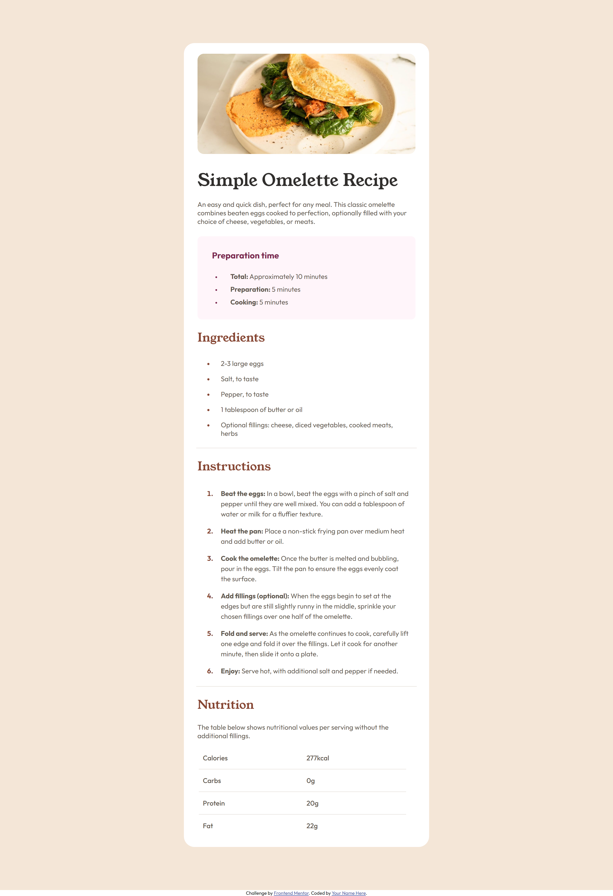
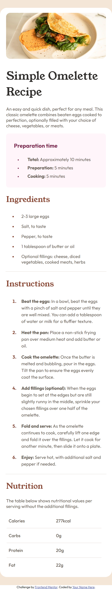

# Frontend Mentor - Recipe page solution

This is a solution to the [Recipe page challenge on Frontend Mentor](https://www.frontendmentor.io/challenges/recipe-page-KiTsR8QQKm). Frontend Mentor challenges help you improve your coding skills by building realistic projects.

## Table of contents

- [Overview](#overview)
  - [The challenge](#the-challenge)
  - [Screenshot](#screenshot)
  - [Links](#links)
- [My process](#my-process)
  - [Built with](#built-with)
  - [What I learned](#what-i-learned)
  - [Continued development](#continued-development)
- [Author](#author)

## Overview

### Screenshot

### Links

- Solution URL: [Add solution URL here](https://your-solution-url.com)
- Live Site URL: [Add live site URL here](https://your-live-site-url.com)

## My process

### Built with

- Semantic HTML5 markup
- CSS custom properties
- Flexbox
- Mobile-first workflow

### What I learned

I utilized media queries for the first time in my CSS, and using the dev tools in Chrome allowed me to set the min-width appropriately for different screen sizes.

### Continued development

I definitely want to spend more time with media queries and really get a better hang of them as well as learn what the typical queries used in professional development are. Are there a standard set of screen sizes that websites are developed for? These are things I don't quite know yet but hope to learn.

## Author

- Frontend Mentor - [@yourusername](https://www.frontendmentor.io/profile/devknightingale)
